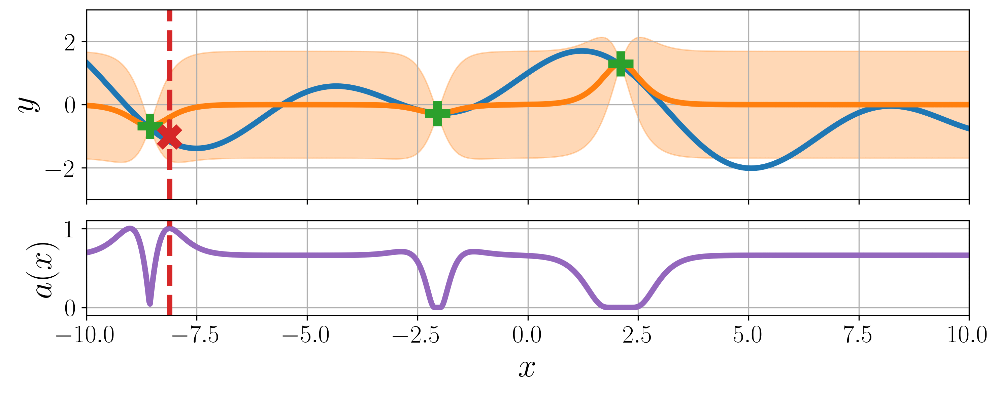

<p align="center">

</p>

# BayesO: A Bayesian optimization framework in Python
[](https://github.com/jungtaekkim/bayeso/actions/workflows/pytest.yml)
[](https://coveralls.io/github/jungtaekkim/bayeso?branch=main)
[](https://pypi.org/project/bayeso/)
[](https://opensource.org/licenses/MIT)
[](https://bayeso.readthedocs.io/en/main/?badge=main)

<p align="center">

</p>

Simple, but essential Bayesian optimization package.

* [https://bayeso.org](https://bayeso.org)
* [Online documentation](https://bayeso.readthedocs.io)

## Installation
We recommend installing it with `virtualenv`.
You can choose one of three installation options.

* Using PyPI repository (for user installation)

To install the released version in PyPI repository, command it.

```shell
$ pip install bayeso
```

* Using source code (for developer installation)

To install `bayeso` from source code, command

```shell
$ pip install .
```
in the `bayeso` root.

* Using source code (for editable development mode)

To use editable development mode, command

```shell
$ pip install -r requirements.txt
$ python setup.py develop
```
in the `bayeso` root.

* Uninstallation

If you would like to uninstall `bayeso`, command it.

```shell
$ pip uninstall bayeso
```

## Required Packages
Mandatory pacakges are inlcuded in `requirements.txt`.
The following `requirements` files include the package list, the purpose of which is described as follows.

* `requirements-optional.txt`: It is an optional package list, but it needs to be installed to execute some features of `bayeso`.
* `requirements-dev.txt`: It is for developing the `bayeso` package.
* `requirements-examples.txt`: It needs to be installed to execute the examples included in the `bayeso` repository.

## Supported Python Version
We test our package in the following versions.

* Python 3.6
* Python 3.7
* Python 3.8
* Python 3.9
* Python 3.10

## Contributor
* [Jungtaek Kim](https://jungtaek.github.io)

## Citation
```
@misc{KimJ2017bayeso,
    author={Kim, Jungtaek and Choi, Seungjin},
    title={{BayesO}: A {Bayesian} optimization framework in {Python}},
    howpublished={\url{https://bayeso.org}},
    year={2017}
}
```

## Contact
* [Jungtaek Kim](https://jungtaek.github.io)

## License
[MIT License](LICENSE)
